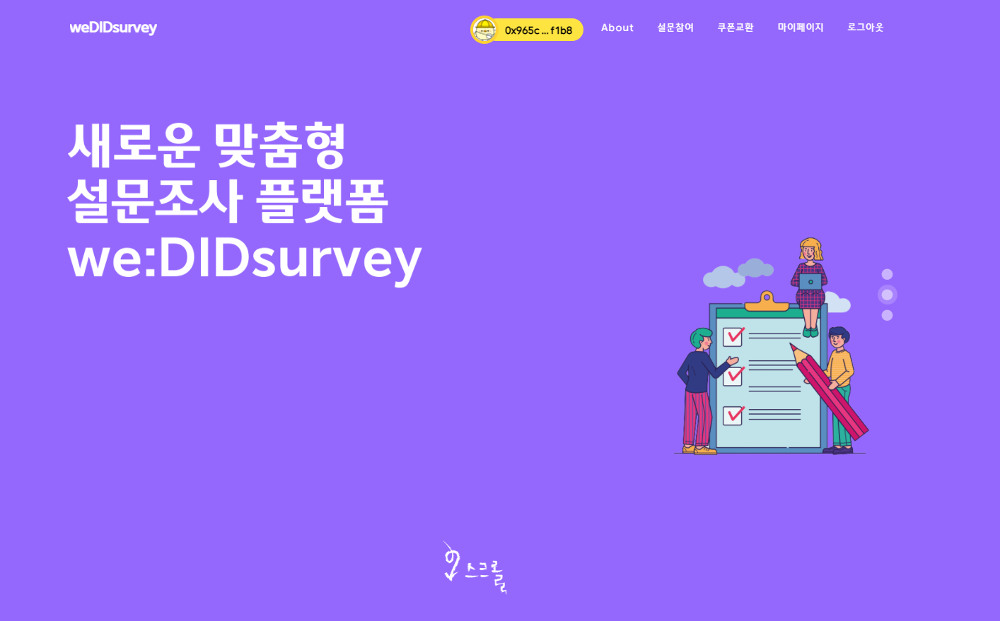
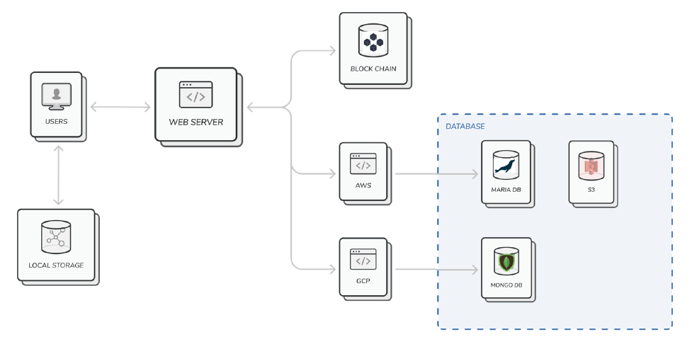
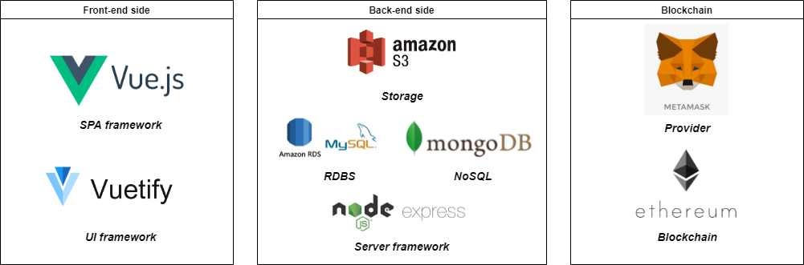
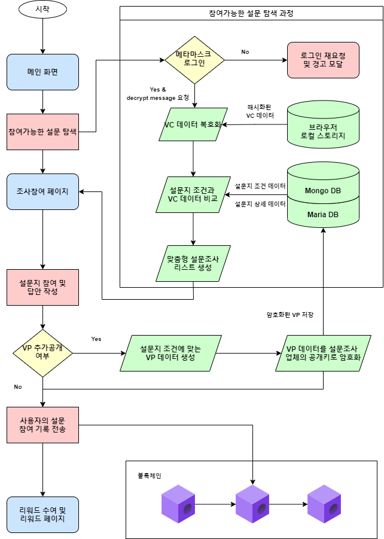

## 🔗 2021 블록체인을 활용한 비즈니스 모델 개발 프로젝트 - DID 기반 패널자격인증 시스템 개발

### 프로젝트 개요

-   프로젝트 과정 : 2021 혁신성장 청년인재 양성사업, 블록체인을 활용한 비즈니스 모델 개발
-   프로젝트 명 : DID 기반 비대면 시장조사 패널자격인증 플랫폼, weDIDsurvey
-   프로젝트 기간 : 21.10.11 ~ 21.11.25
-   구현 목표 :

    1. W3C 표준양식의 VC, VP 기본 양식을 준수하여 사용자의 프라이빗 스토리지에 저장된 VC(검증가능한 크리덴셜) 데이터를 통해 DID 기반 패널자격인증을 통해 사용자 맞춤형 설문조사 참여

    2. Validator(설문의뢰업체) 입장에서의 설문에 참여한 패널들의 VP(검증가능한 프레젠테이션)을 블록체인 스마트 컨트랙트를 통해 검증

</img>
프로젝트 메인 페이지 샘플

### 프로젝트 설명

**1. 서비스 설명**  
DID, Decentralized ID는 프로젝트는 사용자의 개인정보를 개인이 직접 괸라함과 동시에 맞춤형 설문조사 서비스를 이용가능하도록 합니다. 이는 블록체인 시스템을 활용하여 탈중앙화된 방식으로 개인신원자격을 인증가능함을 뜻합니다. 또한, 신원자격인증 절차를 통해 설문조사 의뢰업체의 경우 보다 적절한 패널을 쉽게 확보할 수 있음을 시사합니다. 이에 따라 DID기반 시장조사 플랫폼은 양 사이드에게 합리적인 기대효과를 불러올 수 있습니다.

**2. 현황(문제점)**  
기존 시장조사 플랫폼 서비스의 경우 과도하게 개인정보가 노출이 되거나 혹은 부적합한 사용자들을 설문 도중 강제로 이탈시키는 경우가 많습니다. 이는 패널들의 자격 유효성 불신에서 비롯되는 문제이며 이에 따라 의뢰업체는 보다 더 많은 사람들을 조사하여 적합한 사용자들을 가려내야하기 때문에 불필요한 비용이 지출됩니다. 또한, 중도 탈락자들은 개인의 보상체계가 불투명하다고 느끼며 서비스에 대한 불만족을 갖고 있습니다.

**3. 블록체인 기술을 통해 해결하고자 하는 과제**
블록체인을 통한 탈중앙화 신원증명으로 마이데이터를 가능하게 하며, 신원인증 시 필요한 정보(VP)만을 골라서 제출하도록 합니다. 해당 기술을 활용해 저희 팀은 안전한 개인정보 자기관리와 안전한 개인정보 전달을 실현하고자 하며, 쉬운 패널자격검증이 가능함을 입증하려고 합니다.

### 팀명 : 딩딩(DIng DIng)

### 팀원 소개

1. [PM/도희경](https://github.com/heekyungdo)

-   담당역할 : 팀 리딩, 프론트엔드 및 기획
-   업무내용 :
    1. UI/UX 개발
    2. web3를 이용한 메타마스크 연결
    3. 메타마스크 연결시 사용자에게 맞춤 설문 연결
    4. 클라이언트 사이드 API 요청
    5. DID 서비스 및 시스템 모델 기획

2. [팀원/장태진](https://github.com/tejin3)

-   담당역할 : 컨트랙트 개발 및 풀스택 서포트
-   업무내용 :
    1. 스마트 컨트랙트 개발 및 연결
    2. 메타마스크를 통한 메세지 암호화, 복호화 서비스
    3. 메타마스크 연결시 사용자에게 맞춤 설문 연결
    4. 서버사이드 SQL 작성
    5. DID 서비스 및 시스템 모델 기획

3. [팀원/정은경](https://github.com/luckyjek)

-   담당역할 : 프론트엔드 및 기획
-   업무내용 :
    1. UI/UX 기획
    2. 설문참여 가이드, 예약완료 모달창 제작
    3. 서비스 메인 배너 제작
    4. DID 서비스 및 시스템 모델 기획

4. [팀원/홍대의](https://github.com/HongDaeEui)

-   담당역할 : 프론트엔드 및 기획
-   업무내용 :
    1. DID 서비스 및 시스템 모델 기획
    2. 설문조건과 유저VC 매칭 후 필터링 솔루션 개발
    3. VC to VP 생성 솔루션 개발
    4. 쿠폰/포인트 보상지급 및 상품교환, 설문찜하기 기능 개발
    5. 클라이언트사이드 API 요청 개발
    6. 서버사이드 SQL 작성

5. [팀원/손정습](https://github.com/heekyungdo)

-   담당역할 : 백엔드 개발 및 서비스 기획 총괄
-   업무내용 :
    1. 서버사이드 아키텍쳐 설계
    2. MongoDB, MariaDB CRUD 개발
    3. AWS S3, RDS 인프라 도입
    4. DID 서비스 및 시스템 모델 기획
    5. 서비스 최종 프레젠테이션 작성 및 발표

---

### 프로젝트 세부 수행과정

#### 프로젝트 기획(21.08.25 ~ 21.09.08)

<a href ='./presentation/weDIDsurvey-초기기획서.pdf'  target="_blank">1. weDIDsurvey 프로젝트 기획서 초본</a>

<a href ='./presentation/weDIDsurvey-발표자료.pdf'  target="_blank">3. AMADO 프로젝트 발표자료 준비(21.09.26)</a>

#### 시스템 아키텍쳐

</img>

#### 기술스택 정의서

</img>

#### 프로세스 플로우

</img>

#### 프로젝트 발표 및 개발시연 영상

프로젝트 발표 영상

개발 시연 영상

---

#### 참고자료

-   도서 - 자기주권 신원증명 구조 분석서
    (https://book.naver.com/bookdb/book_detail.nhn?bid=16388829)

-   DID 표준 - W3C, Decentralized Identifiers (DIDs) v1.0
    (https://w3c.github.io/did-core/)

-   DID 표준 국문 - SSImeetupkorea, 검증가능한 크리덴셜 데이터 모델
    (https://ssimeetupkorea.github.io/vc-data-model/#credentials)

-   EIP - EIP-1056, Ethereum Lightweight Identity
    (https://eips.ethereum.org/EIPS/eip-1056)
-   DID registry - Ethereum DID Registry, uport project
    (https://github.com/uport-project/ethr-did-registry)

-   ethr did libraray - Ethr-DID Library, uport project
    (https://github.com/uport-project/ethr-did)
-   Encrypt&Decrypt method - Metamasek rpc methods, eth_getEncryptionPublicKey & eth_decrypt
    (https://docs.metamask.io/guide/rpc-api.html#other-rpc-methods)
-   국내 DID 도입현황 - 팩트경제신문, 차세대 신원확인 기술 ‘DID’를 주목하라
    (https://www.comworld.co.kr/news/articleView.html?idxno=49899)
